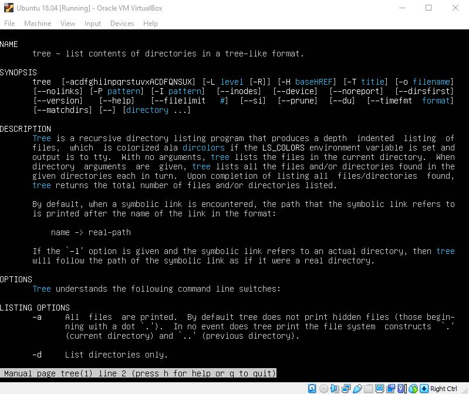
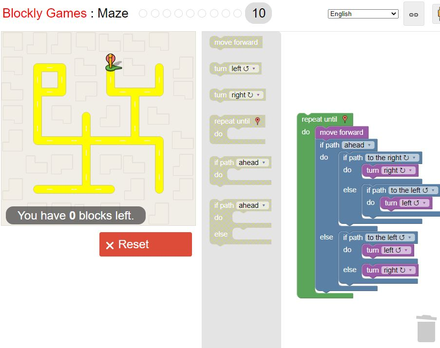

# Lab 01 Report - Introduction to Open Source Software
## Name: Andy Chafy
### email: chafya@rpi.edu

### I joined the Discord : 

### Suggestions for answering questions: 
1) Try to be as percise as possible when searching the web for answers. (Descriptive language, error codes, etc) 
2) When asking others a question, understand that it's okay to be wrong, or have a misunderstanding of the material. 

### My thoughts on Chapter 3 of Free Culture 

Jesse was abused. A giant coorperation decided to bully somone with technical prowess just to make a couple of dollars. Unfortunately the nature of such a lawsuit made it illogical to fight back. Such a suit ended up costing Jesse 12,000 dollars. With the inital claim for 15 millions dollars, clearly there was no actual value lost. If true value was lost the RIAA would not have settled for Jesse's life savings. This was a blatant abuse of power which resulted in a unfair outcome for Jesse. I can only imagine if I had gone through the same events, how infuriated I would be. 

### Ubuntu setup

### 4 Regex

### 5 Snap

### 6 Reflection

A project I hjave always wanted to workon is a personal secretary program. I mainly want to develope an application that is capable of taking tasks such as (Oss Hwk, Est Time:4 hours, Due Date:feb 1st) and scheduling that all tasks can be scheduled to be completed by the time they are due. I have ADHD and often struggle with time management, something like this would most likely save me many missed deadlines and organize my life. Mainly, I would like to be able to manage and store data on task completion time to be able to help those who mismanage their time understnad how long tasks of a certain type actually take them. This would most likely involve developing an ARFIMA or other light weight simple statistical model to help interpret task data. Furthermore I would most likely create my own calander app, or I would use Googles API (although I;m not sure if that fits the theme of open source). 
