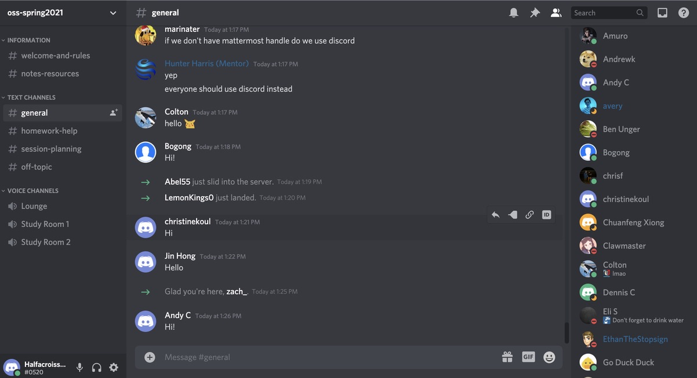
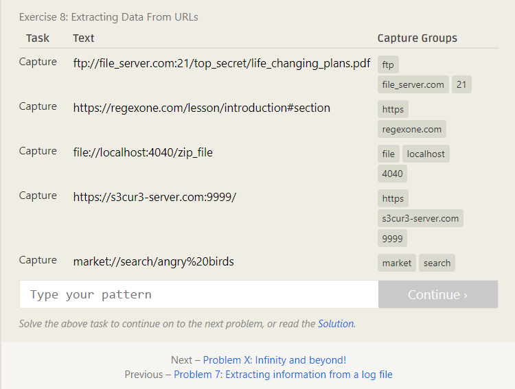
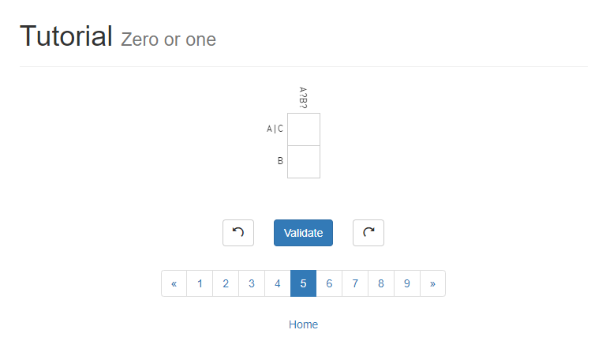

# Lab 01 Report - Introduction to Open Source Software
## Name: Andy Chafy
### email: chafya@rpi.edu

### I joined the Discord : 

### Suggestions for answering questions: 
1) Try to be as percise as possible when searching the web for answers. (Descriptive language, error codes, etc) 
2) When asking others a question, understand that it's okay to be wrong, or have a misunderstanding of the material. 

### My thoughts on Chapter 3 of Free Culture 

Jesse was abused. A giant coorperation decided to bully somone with technical prowess just to make a couple of dollars. Unfortunately the nature of such a lawsuit made it illogical to fight back. Such a suit ended up costing Jesse 12,000 dollars. With the inital claim for 15 millions dollars, clearly there was no actual value lost. If true value was lost the RIAA would not have settled for Jesse's life savings. This was a blatant abuse of power which resulted in a unfair outcome for Jesse. I can only imagine if I had gone through the same events, how infuriated I would be. 

### 4 Regex

### 5 Snap
